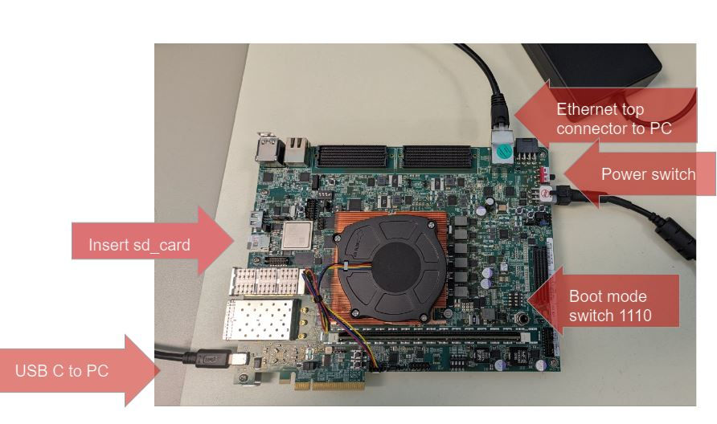

<table class="sphinxhide" width="100%">
 <tr width="100%">
    <td align="center"><h1>Sandpiper: Space Time Adaptive Processing (STAP) Demo</h1>
    </td>
 </tr>
</table>


<br>

# Table of Contents 
- [Table of Contents](#table-of-contents)
- [Introduction](#introduction)
- [Directory Structure](#directory-structure)
- [Build Instructions](#build-instructions)
- [Running the Demo on Hardware](#running-the-demo-on-hardware)
  - [Requirements for the Demo](#requirements-for-the-demo)
    - [MathWorks Software Requirements:](#mathworks-software-requirements)
    - [Hardware Requirements](#hardware-requirements)
    - [Follow these steps to run the Demo with Hardware in the Loop:](#follow-these-steps-to-run-the-demo-with-hardware-in-the-loop)
- [Copyright and Licensing](#copyright-and-licensing)

# Introduction

AMD has partered with Fidus to develop the Sandpiper Space Time Adaptive Processing (STAP) Demo. This demo runs on an AMD Versal™ VCK190 development kit and a host computer with Matlab and Simulink.  The application runs entirely on the VCK190 while the verification and plotting of the results is done by Matlab.  Sandpiper is comprised of two main Digital Signal Processing (DSP) components: a Polyphase Channelizer and the STAP Algorithm.  It also contains several modules that facilitate the demo including the MM2S/S2MM DMAs and the Upsample modules. The below figure shows the Processing Subsystem (PS), Adaptive Intelligent Engines (AIEs), and Programmable Logic (PL) on the VCK190 are all used in this demo.   
<br>


The MATLAB TCP Client connects to a TCP Server running on the PS.  The client sends simulated Radar return IQ samples (also known as Narrow Band Cuboids) and once the VCK190 has processed them it sends back the range vector that Matlab plots.  The PS also responsible for configuring, running, and monitoring the AIEs and PL.  The PL implements DMAs required to drive the demo as well as to move data in and out of the AIEs and external DRAM (LPDDR and DDR).  It also implements the Upsample module which is a digital upconverter used to interpolate the cuboids so they mimic the data coming from a 2GSPS ADC.  Lastly, the PL implements the FFT portion of the Polyphase Channelizer.  The majority of the DSP functionality is implemented In the AIE array.  This consists of the Polyphase FIR and Optimized STAP algorithm.

The overall flow of the demo is depicted in the high level diagram below.


<br><br>

# Directory Structure

Besides the "images" directory that holds the images for this Readme, the directory structure is broken up by compute device. All of the source is contained in the "design" directory as follows.
<br> 
- design
  - **aie_src** - VCK190 AIE source for the Polyphase Channelizer and STAP Algorithm
  - **exec_scripts** - Convenience script to setup the VCK190 for the demo
  - **host_app_src** - VCK190 PS source
  - **pl_src** - VCK190 PL source
  - **xRadar_MatlabModel** - Host PC Matlab Source

<br>

# Build Instructions

**Note: To build the design you need a Linux environment such as Ubuntu, Red Hat, etc.**  

1. Install Vitis 2023.2 per the instructions here: https://docs.amd.com/r/en-US/ug1400-vitis-embedded/Installation
2. Install the Common Images for Embedded Vitis Platforms according to the instructions here: https://docs.amd.com/r/en-US/ug1393-vitis-application-acceleration/Installing-Embedded-Platforms
   1. The download for step two can be found here: https://www.xilinx.com/support/download/index.html/content/xilinx/en/downloadNav/embedded-platforms.html
3. Open a terminal to perform the rest of these steps.
4. Source the settings64.sh script found in your Vitis installation directory 
   
   ```source /opt/amd/Vitis/2023.2/settings64.sh ```
5. Export the following two variables pointing to the Common Image installed in step two:
   
   ```export SDKTARGETSYSROOT=/opt/amd/common_platforms/xilinx-versal-common-v2023.2/sysroots/cortexa72-cortexa53-xilinx-linux```<br>
   ```export XLNX_VERSAL=/opt/amd/common_platforms/xilinx-versal-common-v2023.2```
6. Execute the command to start the build and log it to make.log.  Note this may take several hours to complete:    ```make TARGET=hw all | tee make.log```
7. SD card image will be generated at build/gen_outputs/hw/package/sd_card.img.  Write this image to the VCK190 SD Card using a flashing software such as Balena Etcher: https://etcher.balena.io/.

<br>

# Running the Demo on Hardware

**Once the design is built you can run the demonstration from either Linux or Windows.**

## Requirements for the Demo

### MathWorks Software Requirements:
 - MATLAB (Tested version: R2022a)
 - Simulink
 - Tooloxes: 
    - DSP System            
    - Phased Array System         
    - Radar                                                        
    - Signal Processing     
    - Instrument Control    
    - Fixed-Point Designer 

**Note: If you do not want to generate different Radar return cuboids or look at the upsampler, you do not need Simulink, the Radar, or Phased Array System toolboxes.**

### Hardware Requirements
VCK190 Production Silicon Development Kit

**Ensure that the HW is setup to match the picture below.**


### Follow these steps to run the Demo with Hardware in the Loop: 

1. Launch MATLAB instance and go to the model directory: /\<Demo root directory>/design/xRadar_MatlabModel
2. Set IP address and port number in the getIpAddr function to match what you will use on the VCK190.  You do not need to stick with the Default.  Note: it may be necessary to contact your administrator to change your IP settings of your ethernet adapter.
  
   ```Go to ./getIpAddr.m lines 10 and 11 to change the port and IP address.```

   ```Go to ./Radar/xRadarParam.m to change Radar Model and ADPCA parameters.```

   ```Go to ./Plot/plotParam.m to change Plot parameters``` 

3. (**Optional**) If you want to generate your own Cuboids from Matlab execute the following, otherwise skip to the step 4.
    - Follow the steps in /\<Demo root directory>/design/xRadar_MatlabModel/Radar/STAP_Model_Preparation_Steps.docx
    - run script genCubes to generate the cuboids
    - Note: genCubes executes the SIMULINK model but does NOT open it. If you wish to open the model, prior of running this script type the command:  
   ```open('./Radar/xRadar.slx')```


4. Ensure SD Card is programmed with the image you built above and plugged into the development kit. 
5. Power on the VCK190 and open the UART Terminal to the Versal.
6. The first time you attempt to login (username petalinux), you will need to set a password.  Remember this password.
7. Execute the following commands after logging in:
   ```sudo su```
8. Execute the rest of the commands in the /\<Demo root directory>/design/exec_scripts/run_script.sh bash script.
   - The IP address you program into the VCK190 needs to match what is used in step 2.  
   - You should see this in the terminal after executing the last command:
  
       <br>

9. Execute sendCubes in Matlab which starts the demo


The Client in MATLAB is listening by default and plots the STAP simulation results once the results are received.  There are 10 cubes that will be processed in a loop.  Matlab will display a figure that looks like the diagram below of the results from cube 8.


<br><br>

# Help and Support

Please reach out to your local FAE for any issues regarding this project and they will assist you.

# Copyright and Licensing 

<p class="sphinxhide" align="center"><sub>Copyright © 2023–2024 Advanced Micro Devices, Inc.</sub></p>


MIT License

Permission is hereby granted, free of charge, to any person obtaining a copy of this software and associated documentation files (the "Software"), to deal in the Software without restriction, including without limitation the rights to use, copy, modify, merge, publish, distribute, sublicense, and/or sell copies of the Software, and to permit persons to whom the Software is furnished to do so, subject to the following conditions:

The above copyright notice and this permission notice (including the next paragraph) shall be included in all copies or substantial portions of the Software.

THE SOFTWARE IS PROVIDED "AS IS", WITHOUT WARRANTY OF ANY KIND, EXPRESS OR IMPLIED, INCLUDING BUT NOT LIMITED TO THE WARRANTIES OF MERCHANTABILITY, FITNESS FOR A PARTICULAR PURPOSE AND NONINFRINGEMENT. IN NO EVENT SHALL THE AUTHORS OR COPYRIGHT HOLDERS BE LIABLE FOR ANY CLAIM, DAMAGES OR OTHER LIABILITY, WHETHER IN AN ACTION OF CONTRACT, TORT OR OTHERWISE, ARISING FROM, OUT OF OR IN CONNECTION WITH THE SOFTWARE OR THE USE OR OTHER DEALINGS IN THE SOFTWARE.


<p class="sphinxhide" align="center"><sup><a href="https://www.amd.com/en/corporate/copyright">Terms and Conditions</a></sup></p>


